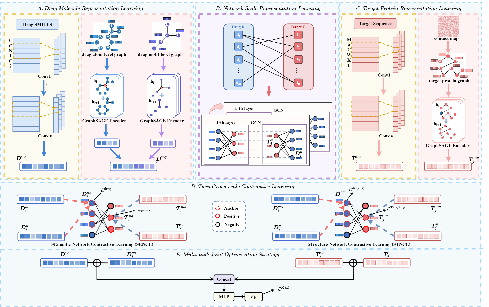

# TCCL
# Twin Cross-scale Contrastive Learning with Multi-modality Fusion for Drug-Target Affinity Prediction

## Overview

<div align="center">
  
</div>
TCCL is an innovative contrastive learning framework with a twin cross-scale approach, designed to integrate multi-modal features for predicting drug-target binding affinity. A dual-stream encoder processes multi-modal data, extracting semantic and structural features of drugs and proteins at the molecular level, while balancing and synthesizing information from diverse sources to enhance feature representation. A network information aggregator extracts topological data from the drug-target bipartite graph, capturing interaction patterns at the network scale. Additionally, a twin cross-scale contrastive learning method, leveraging Semantic-Network Contrastive Learning (SENCL) and Structure-Network Contrastive Learning (STNCL), integrates multi-scale and multi-modal information. This approach enables efficient data fusion through molecular interaction understanding, improving the representation of drug and protein features and enhancing DTA prediction accuracy.


## Environments

```
- python                    3.7.12
- cuda                      11.7
```

## Dependencies

```
- matplotlib                3.5.3
- numpy                     1.21.6
- pandas                    1.3.5
- r-base                    4.0.3
- rpy2                      3.5.1
- scanpy                    1.9.2
- stlearn                   0.4.12
- torch                     1.13.0+cu117
```

## Dataset
DLPFC tissue data are available from spatialLIBD (http://spatial.libd.org/spatialLIBD).

Mouse olfactory bulb tissue data generated by Stereo-seq and Slide-seqV2 platforms can be obtained from https://github.com/JinmiaoChenLab/SEDR_analyses and https://singlecell.broadinstitute.org/single_cell/study/SCP815, respectively.

10x Visium Human Breast Cancer dataset: https://support.10xgenomics.com/spatial-geneexpression/datasets

Bronchial Adenoma dataset available at https://zenodo.org/record/8185216 Accessed.
We provide DLPFC datasets processed in our code.
